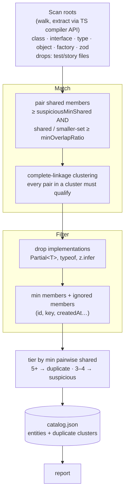

# @md-code/entities-uniqueness

ESLint rule + CLI that finds **duplicate entities** in a TypeScript codebase: classes, interfaces, type literals, object-literal shapes, zod schemas, and constructor functions whose member sets overlap. The same entity (a `Vital`, a `User`, an error shape…) declared in several places should be declared once and shared.

## How it works



1. Extract entities (class, interface, type, object, factory, zod).
2. Match by member names — kind-agnostic.
3. Filter implementations + ignored members.
4. Cluster by complete linkage (every pair must qualify).
5. Tier: 5+ → duplicate, 3–4 → suspicious.
6. ESLint rule flags app entities in a cluster.

## Quick start

```sh
bun add -D @md-code/entities-uniqueness
```

```js
// eslint.config.js
const entitiesUniq = require("@md-code/entities-uniqueness/plugin");

module.exports = [
  {
    plugins: { "md-code": entitiesUniq },
    rules: {
      "md-code/entities-uniqueness": [
        "warn",
        {
          catalogPath: "reports/entities-catalog.json",
          roots: ["core/ehr/"],
        },
      ],
    },
  },
];
```

The catalog is generated automatically on the first lint when the file is
missing (from the `roots` option) — it is gitignored and never committed. You
can also generate it explicitly:

```sh
bunx md-code-entities-uniqueness --roots core/ehr --report reports/entities-duplicates.md
```

## CLI

```sh
bunx md-code-entities-uniqueness [flags]
```

| Flag | Description |
| --- | --- |
| `--roots a:b` | Folders to scan (overrides `roots` from config) |
| `--out <file>` | Catalog output path (default `reports/entities-catalog.json`) |
| `--report [file]` | Write the Markdown duplicate report |
| `--check` | CI gate — exit 1 if catalog is stale |
| `--verbose` | Log per-stage counts |
| `--repo-root <dir>` | Repo root (default: auto-discovered) |

## What it flags

| Tier | Meaning |
| --- | --- |
| `duplicate` | 5+ shared members — the same entity declared in several places |
| `suspicious` | 3–4 shared members — likely the same entity; review and merge |

## Options (rule config)

| Option | Default | Meaning |
| --- | --- | --- |
| `catalogPath` | `reports/entities-catalog.json` | Catalog built by the CLI |
| `roots` | — | Folders to scan (CLI or config) |
| `minMembers` | `3` | An entity needs at least this many members to be considered |
| `suspiciousMinShared` | `3` | Shared members → *suspicious* |
| `duplicateMinShared` | `5` | Shared members → *definite duplicate* |
| `minOverlapRatio` | `0.4` | shared / smaller-member-set ratio floor |
| `ignoredMethods` | `id`, `key`, `uuid`, `createdAt`, `updatedAt`, `deletedAt`, … | Members excluded from overlap counting |
| `requireExported` | `false` | Only exported entities |
| `include` / `exclude` | build artifacts excluded | Glob filters |
| `debt` | ledger at `reports/lint-debt.json` | Debt ledger (`false` to disable) |

## Report

`reports/entities-duplicates.md` groups findings into **Definite duplicates**
and **Suspicious overlap**, each cluster showing the canonical entity, the
shared members, and a table of every duplicate with its kind and location.
